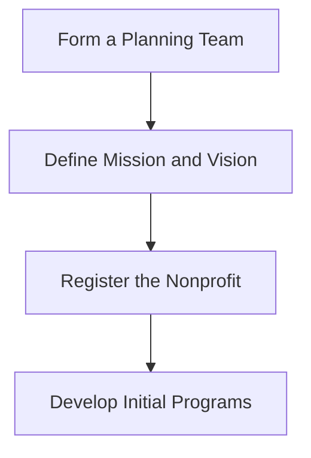

# SCANet Initial Planning Flowchart

## Description
1. **Form a Planning Team (A)**
   - **Purpose:** Assemble a group of dedicated individuals passionate about storm chasing and community assistance.
   - **Significance:** A strong team lays the foundation for the organization's success.
     
2. **Define Mission and Vision (B)**
   - **Purpose:** Clearly articulate SCANet's purpose and long-term goals.
   - **Significance:** Guides all future decisions and strategies.

3. **Register the Nonprofit (C)**
   - **Purpose:** Legally establish SCANet as a nonprofit organization.
   - **Significance:** Enables the organization to operate legally and receive donations.

4. **Develop Initial Programs (D)**
   - **Purpose:** Create programs that align with the mission to assist storm chasers and affected communities.
   - **Significance:** Provides value to the community and attracts support.

